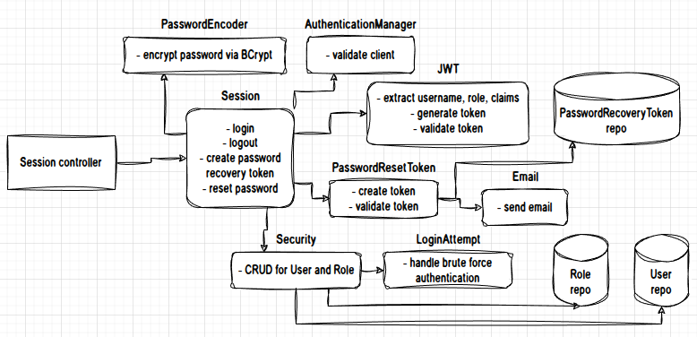
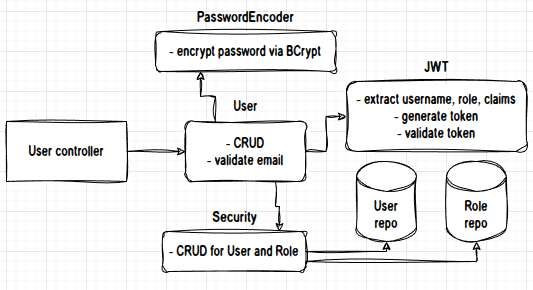
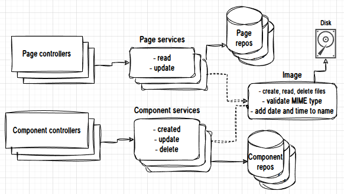

# Description
A back-end web app made with Java/Spring for SPA front-end frameworks that I base on my every project.

## Terms
### Page:
Represents web pages that contain texts and images like the About page.

### Component:
Represents CSS components like Carousel and Modal. Components I used in this project:

- __Carousel Section__: Represents a section of a Carousel component.
- __Simple Card__: A Card component for small texts and contains an image.
- __Detailed Card__: Similar to Simple Card but for large texts.
- __Phone__: This is more like an extension for Contact page rather than a CSS component. It contains phone number and a tag field that describes what the phone number is used for.

Every component has a _displayOrder_ attribute for sorting them on the front-end.

## Page and Component services
Components are creatable, updated and deletable but pages are not creatable and deletable. Pages have one-to-one relationship with locales and one-to-many with components.

## Image service
Image service is responsible for storing and serving image files.
The service adds current date and time to the names of image files when storing them which makes them unique for ETag headers. A directory for storing/serving image files will be created upon the start if there is not.

Accepted image files are SVG, WEBP, GIF, JPEG and PNG. Servlet maximum multipart size is set to 1 MB, I minimize images on frontend.

## Security
User session is stateless and used with JWT standard. There is a Login Attempt Service that handles brute force authentication. And there is also a forgotten password reset function that sends confirmation link to email for setting a new password.

Two user roles as Administrator and Moderator. Both roles have full access on Page and Component services but only Administrator role has access to User service.

## Caching
For client side caching, I use responses' hashcode and image files' name for ETag headers.

# Features
- Spring MVC
- OpenAPI
- Spring JPA, Hibernate
- PostgreSQL
- 3 pages
    - About
    - Contact
    - Home
- 4 components
    - Carousel Section
    - Simple Card
    - Detailed Card
    - Phone
- 2 localizations
    - English
    - Turkish
- Image storing, serving.
- Caching
    - Client side
    - Server side
- SPA routing
- Stateless session with JWT standard
- Brute Force Authentication handler
- Forgotten password reset
- 2 hierarchical user roles
    - Administrator
    - Moderator

# Working Diagram
**Session service:**

**User service:**

**Page and Component services:**

